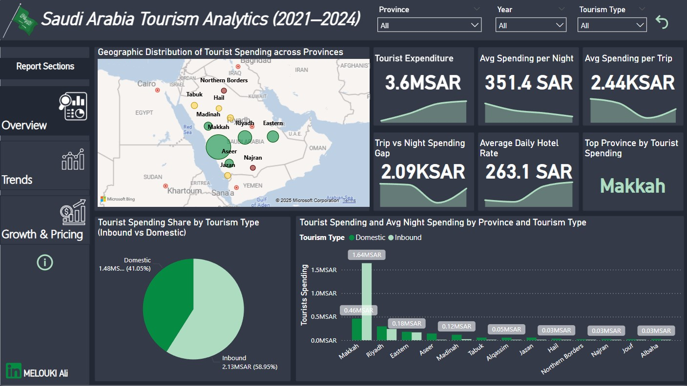

# saudi-tourism-analytics-2021-2024

This project explores tourism patterns in Saudi Arabia between 2021–2024 using PostgreSQL for data analysis and Power BI for visualization. The goal is to understand how spending, accommodation pricing, and tourist types evolved over time.

🔹 SQL Analysis Highlights :

Growth Trends (Domestic vs Inbound) :

1- Domestic tourism is consistently the backbone of Saudi travel, but inbound tourism grew rapidly, especially in Makkah where inbound spending jumped by +2687% in 2022.

2- Some regions like Najran and Northern Borders showed highly volatile inbound growth, suggesting they are emerging but unstable markets.

Top Provinces by Spending :

1- Makkah dominates with over 1.18M SAR in spending (far ahead of Riyadh at ~292K SAR).

2- Riyadh and the Eastern Province follow, while Aseer and Madinah are rising secondary hubs.

Accommodation Pricing (ADR Trends) :

1- Hotels are consistently more expensive than apartments, with Riyadh hotels peaking at 926 SAR in 2024.

2- Apartments remain affordable, averaging ~150–250 SAR across provinces, suggesting budget options are widely available.

Inbound vs Domestic Comparison :

1- By 2024, Inbound tourists (81K) spent ~482K SAR, outpacing domestic tourists in per-capita spending.

2- Domestic tourists (172K) still contributed steady volume, highlighting the dual importance of both segments.

Spending Efficiency :

1- Provinces like Makkah & Riyadh have higher spend per trip, while smaller provinces (e.g., Albaha, Najran) remain budget-friendly.

2- Over time, spending per night decreased slightly, possibly due to competitive accommodation pricing.

🔹 Power BI Dashboard Insights

The dashboard is divided into three main pages:

1- Overview :

- Provides a high-level look at tourist spending, ADR, and geographic distribution.

- Makkah consistently stands out as the top-spending province.

2- Trends :

- Shows ADR differences between Hotels and Apartments → Hotels rise much faster.

- Spending growth chart highlights Top 5 Provinces (Makkah, Riyadh, Eastern, Aseer, Madinah).

3- Growth & Pricing :

- Combines spending efficiency (per trip & per night) with inbound vs domestic breakdown.

- Inbound tourists, while fewer, contribute disproportionately higher spending.

🔹 Key Takeaways :

- Makkah is the tourism powerhouse of Saudi Arabia, especially for inbound religious tourism.

- Riyadh and Eastern Province are economic hubs attracting both business and leisure visitors.

- Hotel prices are rising faster than tourist spending, which could squeeze affordability if the trend continues.

- Domestic tourism is stable but slower-growing, while inbound tourism is more volatile but highly lucrative.

⚙️ Tools Used :

Database: PostgreSQL (SQL queries for cleaning & aggregation)

Visualization: Power BI (interactive dashboard, KPI cards, geo-maps, decomposition trees)

Data: Aggregated from tourism & hotel ADR datasets (2021–2024)

